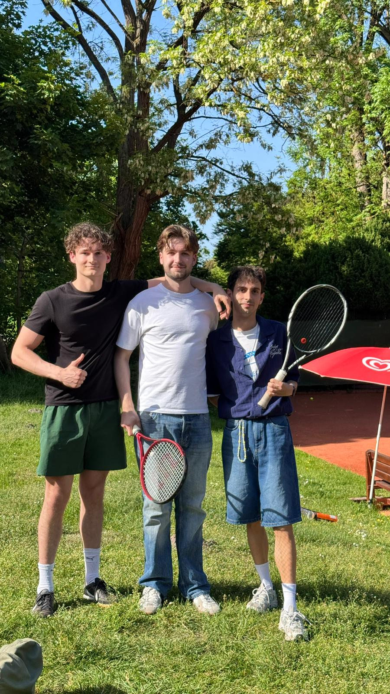

# ML4SCS Tennis Stroke Classification

Semester project for **Machine Learning for Smart and Connected Systems**.

The project explores whether Apple Watch motion data can be used to detect and
classify tennis strokes. It combines smartwatch sensor recordings, video-based
labeling, feature extraction, baseline machine-learning models, and a companion
Watch/iPhone app for collecting and streaming new sessions.



## Project Goal

The central research question is:

> Can movement and IMU data from a smartwatch be used to automatically detect
> and classify tennis strokes?

The current target classes include forehand, backhand, serve, slice, and
non-stroke movement. The project focuses on a practical end-to-end workflow:
recording sensor data, aligning it with video labels, training models, and using
the results in a live tennis-tracking setup.

## What This Repository Contains

```text
Daten/             Raw and labeled tennis recordings
labels/            Event labels created from video review
src/               Shared preprocessing, prediction, and model code
tools/             Labeling, prediction, dashboard, and simulator tools
baseline_models/   Random-Forest baseline model and evaluation artifacts
TennisTracker/     iPhone + Apple Watch Xcode project
docs/              Project notes and supporting documentation
reports/           Weekly project reports
```

## Main Components

**Data collection and labeling**  
Apple Watch motion recordings are paired with video footage. The video is used
to mark stroke events, which are then used to create training and evaluation
data.

**Modeling pipeline**  
The Python pipeline supports preprocessing, feature extraction, training, and
prediction. A Random-Forest baseline is included as a reference model for
evaluating stroke classification performance.

**TennisTracker app**  
`TennisTracker/` contains the iPhone and Apple Watch app. The app supports
recording sessions and streaming motion data to a local dashboard for live
inspection and prediction.

**Dashboards and helper tools**  
The `tools/` directory contains utilities for offline labeling, prediction
review, live dashboarding, and simulated sensor streams.

## Team

- Florian Schneider
- Marcel Vogeler
- Metehan Tetik
